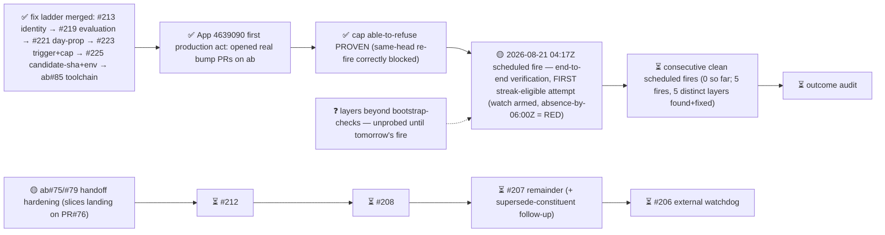

# M2 — Amaru tested routinely under fault injection

State — Updated: 2026-08-20
Legend: ✅ done · 🟡 active/next · ⏳ queued · ⛔ blocked · ❓ unknown

Notes: 2026-08-20 was the fix→fire compression day — five defect layers (state machine, env propagation, candidate-sha, PATH/bare-env, Rust-nightly toolchain drift) all found by fires and fixed same-day across both repos. Zero real Antithesis launches yet; allowance untouched; every red named. Cross-org App identity works in production. Next unknown begins where bootstrap-checks ended.
