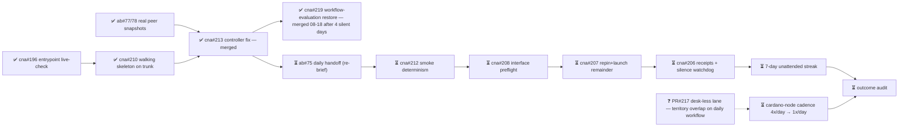

# M2 — Amaru tested routinely under fault injection

State — Updated: 2026-08-18
Legend: ✅ done · 🟡 active/next · ⏳ queued · ⛔ blocked · ❓ unknown

🟡 Next action (operator): provision the dedicated least-privilege GitHub App on lambdasistemi/amaru-bootstrap; DAILY_AMARU_APP_ID + DAILY_AMARU_APP_PRIVATE_KEY into cna. Until then the daily fire is an ⛔ explicit named-credential RED — honest, zero spend. The App turns it green.

Notes: INCIDENT 08-15→08-18 — #218 broke workflow evaluation; the daily schedule was silently dead 4 days (no fires, no receipts, no alarm); fixed by #219/PR#220 (merged 18:06Z). Lesson banked in registry: the absence watchdog (#206) must live OUTSIDE the workflow it watches. Next fire should produce the explicit named-credential RED — the App (operator item, day 12) turns it green. Zero real Antithesis runs consumed to date. Parked: t75, cadence, #212/#208/#207/#206.
