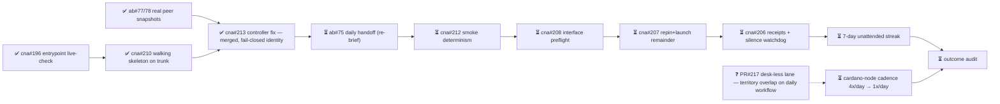

# M2 — Amaru tested routinely under fault injection

State — Updated: 2026-08-14
Legend: ✅ done · 🟡 active/next · ⏳ queued · ⛔ blocked · ❓ unknown

🟡 Next action (operator): provision the dedicated least-privilege GitHub App on lambdasistemi/amaru-bootstrap; DAILY_AMARU_APP_ID + DAILY_AMARU_APP_PRIVATE_KEY into cna. Until then the daily fire is an ⛔ explicit named-credential RED — honest, zero spend. The App turns it green.

Notes: cna#213 merged 2026-08-14 (PR#218) — controller crash fixed; from the next 04:17Z fire, a missing App yields an explicit RED receipt naming the credentials. Zero real Antithesis runs consumed to date. Chain otherwise parked; resume order: t75 re-brief → cadence ticket → #212 → #208 → #207 → #206.
