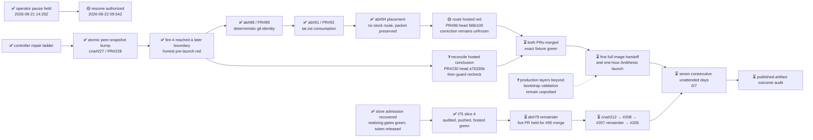

# M2 — Amaru tested routinely under fault injection

State — Updated: 2026-08-22

Legend: ✅ done · 🟡 active/next · ⏳ queued · ⛔ blocked · ❓ unknown

> 🟡 **Operator resume authorized 2026-08-22T09:54:57Z.** The parked snapshot
> remains authoritative until the cna#205 epic owner acknowledges the wake.
> It will first retire obsolete milestone windows and reconcile the external
> GitHub Actions conclusions from the exact parked heads. No conclusion that
> arrived while parked grants merge, fixture, or fire authority by itself.

Fire-4, controller run
[32470212421](https://github.com/cardano-foundation/cardano-node-antithesis/actions/runs/32470212421),
live-proved the atomic peer-snapshot fix, then failed closed because candidate
CI was observed only three seconds after push. The subsequent fixes isolated
and repaired each later Amaru packaging boundary without an image handoff or
Antithesis spend. The milestone streak remains **0/7**.

At resume, the next production fire remains gated by two draft pull requests.
Their hosted conclusions must be reconciled from the exact parked heads before
the owning lanes choose any next action:

- [PR#230](https://github.com/cardano-foundation/cardano-node-antithesis/pull/230)
  carries bounded candidate-check observation and complete fault labeling.
  The one-file hosted ShellCheck correction passed independent audit, and
  exact head `a76330b` is green on Daily Amaru dry-run, build, unit, quality,
  docs, preview, and image publication. Compose smoke is the only hosted
  context left running at the park boundary. Its eventual conclusion has not
  been reconciled by an agent. The PR remains draft and unmerged.
- [amaru-bootstrap PR#96](https://github.com/lambdasistemi/amaru-bootstrap/pull/96)
  carries the SHA-bound, repository-versioned custom-network era-history patch
  with executable retirement. Final independent audit passed all eight
  blocking rows with no residuals. Exact squashed head `fd6b100` is pushed.
  The already-started hosted run returned red while the pause propagated; the
  ticket owner recorded it, preserved an unfrozen forward-correction draft as
  resume context, and parked clean without starting correction work. Hosted
  live proof and the byte-unchanged
  [PR#93 fixture](https://github.com/lambdasistemi/amaru-bootstrap/pull/93)
  remain required before merge.

Amaru-bootstrap#88/PR#89 and #91/PR#92 are merged as `80b71cc` and
`8e17e68`. Issue #94 proved no stock in-repo route and closed
packet-delivered; its operator packet remains local and nothing was published
upstream.

The t75 handoff slice remains accepted at `b7d835a`, independently audited,
pushed, and hosted-green. The ab#79 remainder is parked; its live-PR phase
remains held until #95 merges and the exact fixture is green.

The operator authorized resume at 09:54:57Z on 2026-08-22. The cna#205 epic
owner must clean obsolete milestone windows, wake only the lanes required by
the critical path, and acknowledge the resumed subtree before work is called
active. Durable park receipts remain: cna#229+#231 at 14:35:12Z on `a76330b`,
amaru-bootstrap#95 at 14:36:54Z on `fd6b100`, and t75/ab#79 at 14:38:09Z.
The cna#205 epic owner appended its terminal `PARKED operator-pause-all` event
at 14:38:42Z; that cold snapshot is the resume base.

The frozen seven-consecutive-day outcome cannot finish by the current
2026-08-28 due date because the first 2026-08-21 eligible attempt was red.
Preserve the acceptance test and reforecast the date after resume; never waive
the streak.
