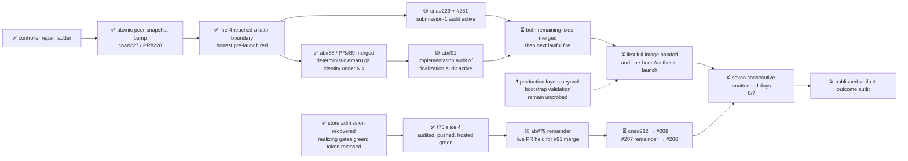

# M2 — Amaru tested routinely under fault injection

State — Updated: 2026-08-21

Legend: ✅ done · 🟡 active/next · ⏳ queued · ⛔ blocked · ❓ unknown

Fire-4, controller run
[32470212421](https://github.com/cardano-foundation/cardano-node-antithesis/actions/runs/32470212421),
live-proved the atomic peer-snapshot fix: the unattended proposal updated the
Amaru/configuration pins and regenerated resolution record together, and the
old anchor failure did not recur. It failed closed one stage later because the
controller examined candidate CI only three seconds after push and treated a
not-yet-reported Build check as a terminal failure. The candidate then exposed
a second our-side packaging gap: Amaru's `build.rs` required git information
that a Nix-fetched source tree did not supply. No image handoff or Antithesis
launch occurred.

The next production fire is gated by two remaining active campaigns:

- [cna#229](https://github.com/cardano-foundation/cardano-node-antithesis/issues/229)
  plus its governed false-receipt recut
  [cna#231](https://github.com/cardano-foundation/cardano-node-antithesis/issues/231)
  on [PR#230](https://github.com/cardano-foundation/cardano-node-antithesis/pull/230);
- [amaru-bootstrap#91](https://github.com/lambdasistemi/amaru-bootstrap/issues/91)
  consumes the upstream tar.zst snapshot archives and must make the exact
  fire-4-shape fixture
  [PR#90](https://github.com/lambdasistemi/amaru-bootstrap/pull/90) green.

Amaru-bootstrap#88/PR#89 merged as `80b71cc` after all three hosted contexts
passed; deterministic git identity is now proven at both stock and exact
candidate shapes. PR#90 then exposed upstream's archive-format change. #91's
implementation audit passed 6/6 rows on `c85b2b3`; final `3c63faa` is under an
independent finalization-delta audit, and its hosted candidate/fixture proof is
still pending. #231's submission-1 candidate `7516653` is also under
independent audit. PR#230's old dry-run red is not an accepted head. The next
fire waits for #229+#231 and #91 to merge; PR#90's fixture stays unweakened.

The t75 handoff lane crossed its slice terminal. Its independent audit passed
5/5 rows at set-point, final `b7d835a` has an exact task-stamp tree proof, and
every current hosted context on PR#76 is green. The epic owner accepted slice
4 and routed the lane into ab#79's remainder; its live-PR phase waits for #91's
merge. Fresh store capacity remains above the 54 GiB one-lane bar.

The streak remains **0/7**. Since the first 2026-08-21 streak-eligible attempt
was red, the frozen seven-consecutive-day outcome cannot finish before the
current 2026-08-28 due date. Preserve acceptance and reforecast the date.
