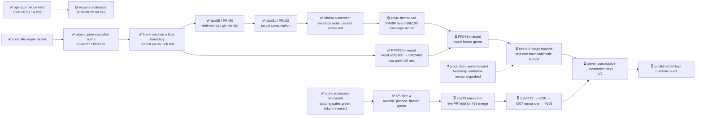

# M2 — Amaru tested routinely under fault injection

State — Updated: 2026-08-22

Legend: ✅ done · 🟡 active/next · ⏳ queued · ⛔ blocked · ❓ unknown

> 🟡 **Active after operator resume at 2026-08-22T09:54:57Z.** The cna#205
> epic owner acknowledged the wake, retired obsolete windows, reconciled both
> exact-head hosted conclusions, and resumed the critical path. PR#230 is now
> merged; PR#96's hosted red is being handled under its existing campaign law.

Fire-4, controller run
[32470212421](https://github.com/cardano-foundation/cardano-node-antithesis/actions/runs/32470212421),
live-proved the atomic peer-snapshot fix, then failed closed because candidate
CI was observed only three seconds after push. The subsequent fixes isolated
and repaired each later Amaru packaging boundary without an image handoff or
Antithesis spend. The milestone streak remains **0/7**.

At resume, both parked hosted conclusions were reconciled from their exact
heads. The next production fire is now gated only by amaru-bootstrap#95:

- [PR#230](https://github.com/cardano-foundation/cardano-node-antithesis/pull/230)
  reconciled exact head `a76330b` with all nine guard contexts satisfied,
  including Compose smoke success. It merged as `64024b9`; issues #229 and
  #231 are closed and the Cardano-node Antithesis half of the fire gate is met.
- [amaru-bootstrap PR#96](https://github.com/lambdasistemi/amaru-bootstrap/pull/96)
  carries the SHA-bound, repository-versioned custom-network era-history patch
  with executable retirement. Final independent audit passed all eight
  blocking rows with no residuals. Exact squashed head `fd6b100` is pushed.
  The already-started hosted run returned red while the pause propagated. The
  #95 ticket owner is active, classifying that exact artifact and its unfrozen
  forward-correction draft under the unchanged campaign law. Hosted live proof
  and the byte-unchanged
  [PR#93 fixture](https://github.com/lambdasistemi/amaru-bootstrap/pull/93)
  remain required before merge.

Amaru-bootstrap#88/PR#89 and #91/PR#92 are merged as `80b71cc` and
`8e17e68`. Issue #94 proved no stock in-repo route and closed
packet-delivered; its operator packet remains local and nothing was published
upstream.

The t75 handoff slice remains accepted at `b7d835a`, independently audited,
pushed, and hosted-green. The ab#79 remainder is parked; its live-PR phase
remains held until #95 merges and the exact fixture is green.

Window cleanup is complete. Terminal #94, merged #91, and post-merge #229/#231
windows were retired with their runtime roots archived; no worktree or runtime
evidence was deleted. Four windows remain: the milestone desk, cna#205 epic
owner, active #95 ticket owner, and parked/queued t75 owner. The 2026-08-22
04:17Z scheduled fire still needs same-day reconciliation; it remains
`❓ unknown` until its real terminal is recorded.

The frozen seven-consecutive-day outcome cannot finish by the current
2026-08-28 due date because the first 2026-08-21 eligible attempt was red.
Preserve the acceptance test and reforecast the date after resume; never waive
the streak.
