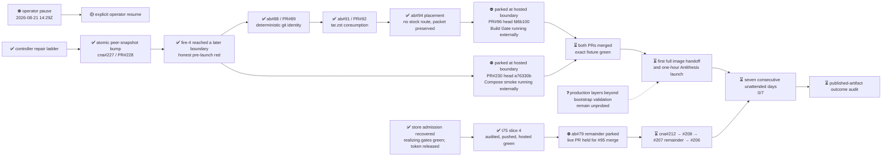

# M2 — Amaru tested routinely under fault injection

State — Updated: 2026-08-21

Legend: ✅ done · 🟡 active/next · ⏳ queued · ⛔ blocked · ❓ unknown

> ⛔ **Operator pause effective 2026-08-21T14:29:22Z.** All milestone
> workers are being parked at durable boundaries. Already-started GitHub
> Actions are not being cancelled and may finish while agents are paused.
> No merge, fixture dispatch, production fire, or new work will occur until
> the operator explicitly resumes all workers.

Fire-4, controller run
[32470212421](https://github.com/cardano-foundation/cardano-node-antithesis/actions/runs/32470212421),
live-proved the atomic peer-snapshot fix, then failed closed because candidate
CI was observed only three seconds after push. The subsequent fixes isolated
and repaired each later Amaru packaging boundary without an image handoff or
Antithesis spend. The milestone streak remains **0/7**.

At the pause boundary, the next production fire remains gated by two draft
pull requests:

- [PR#230](https://github.com/cardano-foundation/cardano-node-antithesis/pull/230)
  carries bounded candidate-check observation and complete fault labeling.
  The one-file hosted ShellCheck correction passed independent audit, and
  exact head `a76330b` is green on Daily Amaru dry-run, build, unit, quality,
  docs, preview, and image publication. Compose smoke is the only hosted
  context still running. The PR remains draft and unmerged.
- [amaru-bootstrap PR#96](https://github.com/lambdasistemi/amaru-bootstrap/pull/96)
  carries the SHA-bound, repository-versioned custom-network era-history patch
  with executable retirement. Final independent audit passed all eight
  blocking rows with no residuals. Exact squashed head `fd6b100` is pushed;
  documentation deploy is green and Build Gate is running. Hosted live proof
  and the byte-unchanged
  [PR#93 fixture](https://github.com/lambdasistemi/amaru-bootstrap/pull/93)
  remain required before merge.

Amaru-bootstrap#88/PR#89 and #91/PR#92 are merged as `80b71cc` and
`8e17e68`. Issue #94 proved no stock in-repo route and closed
packet-delivered; its operator packet remains local and nothing was published
upstream.

The t75 handoff slice remains accepted at `b7d835a`, independently audited,
pushed, and hosted-green. The ab#79 remainder is parked; its live-PR phase
remains held until #95 merges and the exact fixture is green.

The frozen seven-consecutive-day outcome cannot finish by the current
2026-08-28 due date because the first 2026-08-21 eligible attempt was red.
Preserve the acceptance test and reforecast the date after resume; never waive
the streak.
