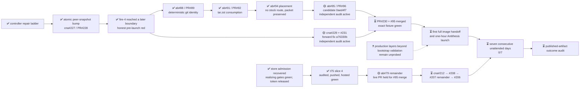

# M2 — Amaru tested routinely under fault injection

State — Updated: 2026-08-21

Legend: ✅ done · 🟡 active/next · ⏳ queued · ⛔ blocked · ❓ unknown

Fire-4, controller run
[32470212421](https://github.com/cardano-foundation/cardano-node-antithesis/actions/runs/32470212421),
live-proved the atomic peer-snapshot fix, then failed closed because candidate
CI was observed only three seconds after push. The same candidate exposed a
sequence of Amaru packaging interfaces; each repair has been isolated and
proven one boundary at a time. No image handoff or Antithesis launch occurred.

The next production fire is gated by two active campaigns:

- [cna#229](https://github.com/cardano-foundation/cardano-node-antithesis/issues/229)
  plus governed recut
  [cna#231](https://github.com/cardano-foundation/cardano-node-antithesis/issues/231)
  on draft [PR#230](https://github.com/cardano-foundation/cardano-node-antithesis/pull/230).
  #231 closed PASS on `63bdc61`; final `2859302` is the audited tree plus its
  task stamp and was pushed. Hosted run 32487469955 then failed deterministically
  in ShellCheck on the new fixture. No rerun or merge is allowed. A distinct
  one-file forward-correction campaign produced candidate `a76330b` with its
  frozen gate green. The owner is complete and parked; a fresh detached Codex
  audit is active at submission 1/2. The candidate is not yet accepted or
  pushed.
- [amaru-bootstrap#95](https://github.com/lambdasistemi/amaru-bootstrap/issues/95)
  implements desk ruling A-EPIC-003: one explicit build-time patch carrying
  custom-network era history into upstream `node bootstrap`, with the bare
  upstream SHA and patch hash in build identity and executable retirement.
  Placement and mandate are frozen, draft
  [PR#96](https://github.com/lambdasistemi/amaru-bootstrap/pull/96) is at
  planning head `5dd7c8f`. The Grok owner completed RED/GREEN proof from
  `5205a98` to candidate `0aed4f7`; a fresh full-scope detached Codex audit is
  active. The candidate is not yet accepted, pushed, or fixture-proven.

Amaru-bootstrap#88/PR#89 and #91/PR#92 are merged as `80b71cc` and `8e17e68`.
Closed evidence [PR#93](https://github.com/lambdasistemi/amaru-bootstrap/pull/93)
head `b52ca563` proved #91's archive fix and then failed one layer later when
upstream `amaru bootstrap` refused `testnet_42`. #94 proved there is no
stock in-repo route, closed packet-delivered, and published nothing upstream.
PR#93 stays byte-unchanged as #95's acceptance instrument.

The t75 handoff lane remains accepted at `b7d835a`, with its independent audit
5/5 and all current PR#76 contexts green. The ab#79 remainder continues, while
its live-PR phase waits for #95's merge and the exact fixture to go green.

The streak remains **0/7**. Since the first 2026-08-21 streak-eligible attempt
was red, the frozen seven-consecutive-day outcome cannot finish before the
current 2026-08-28 due date. Preserve acceptance and reforecast the date.
