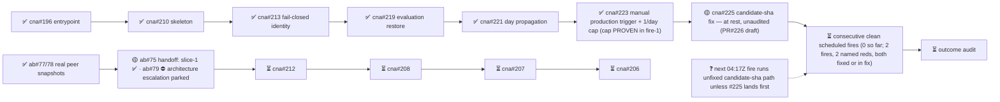

# M2 — Amaru tested routinely under fault injection

State — Updated: 2026-08-19
Legend: ✅ done · 🟡 active/next · ⏳ queued · ⛔ blocked · ❓ unknown

🟡 PAUSED by operator 2026-08-19 16:07Z — all lanes at recorded rest points, resume is one word at the desk. App 4639090 live; no operator actions pending. Fires: schedule 04:27Z (state-machine red → fixed by #222), dispatch 14:01Z (candidate-sha red → #225 in fix). Zero real Antithesis runs consumed to date; every red named same-hour. Fix→fire loop proven at 4-minutes-to-named-red.
