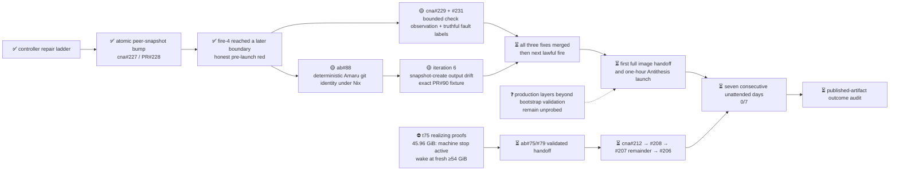

# M2 — Amaru tested routinely under fault injection

State — Updated: 2026-08-21

Legend: ✅ done · 🟡 active/next · ⏳ queued · ⛔ blocked · ❓ unknown

Fire-4, controller run
[32470212421](https://github.com/cardano-foundation/cardano-node-antithesis/actions/runs/32470212421),
live-proved the atomic peer-snapshot fix: the unattended proposal updated the
Amaru/configuration pins and regenerated resolution record together, and the
old anchor failure did not recur. It failed closed one stage later because the
controller examined candidate CI only three seconds after push and treated a
not-yet-reported Build check as a terminal failure. The candidate then exposed
a second our-side packaging gap: Amaru's `build.rs` required git information
that a Nix-fetched source tree did not supply. No image handoff or Antithesis
launch occurred.

The next production fire is gated by two parallel hosted-proof campaigns:

- [cna#229](https://github.com/cardano-foundation/cardano-node-antithesis/issues/229)
  plus its governed false-receipt recut
  [cna#231](https://github.com/cardano-foundation/cardano-node-antithesis/issues/231)
  on [PR#230](https://github.com/cardano-foundation/cardano-node-antithesis/pull/230);
- [amaru-bootstrap#88](https://github.com/lambdasistemi/amaru-bootstrap/issues/88)
  on stock-proof [PR#89](https://github.com/lambdasistemi/amaru-bootstrap/pull/89)
  and fire-4-shape fixture
  [PR#90](https://github.com/lambdasistemi/amaru-bootstrap/pull/90).

PR#89 is green in all three hosted contexts. PR#90 proves the git-info fix at
the exact candidate shape: Amaru built and `amaru snapshot create` executed.
It then failed the next interface contract because current upstream produced
0 of at least 3 required snapshot directories. That named snapshot-create
output drift becomes iteration 6 when #88 closes; the fixture stays intact.
PR#230 remains an active campaign and its current dry-run red is not an
accepted head. The next fire waits for all three fixes: #229+#231, #88, and
the snapshot-output iteration with PR#90 green and unweakened.

The t75 handoff repair is parked with its repair bounce intact. The normal
one-lane `/nix/store` admission bar remains 54 GiB. Capacity briefly reached
53.90 GiB, then fell again; the epic owner's fresh 11:41Z measurement was
49,352,531,968 bytes (45.96 GiB). The below-50 GiB machine stop is active, no
realization is running in the subtree, and wake still requires a later fresh
measurement at or above 54 GiB.

The streak remains **0/7**. Since the first 2026-08-21 streak-eligible attempt
was red, the frozen seven-consecutive-day outcome cannot finish before the
current 2026-08-28 due date. Preserve acceptance and reforecast the date.
