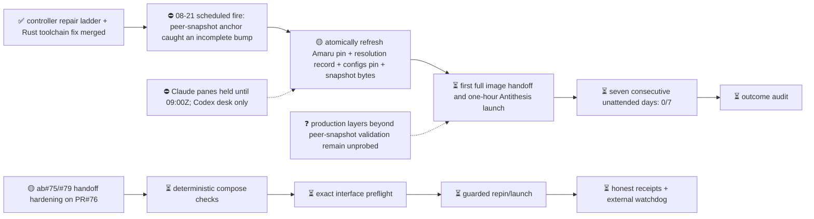

# M2 — Amaru tested routinely under fault injection

State — Updated: 2026-08-21
Legend: ✅ done · 🟡 active/next · ⏳ queued · ⛔ blocked · ❓ unknown

The 2026-08-21 scheduled controller reached bootstrap validation and opened
real amaru-bootstrap PR #86 for Amaru `8fdca45b`. Its Build Gate correctly
refused the candidate: the unattended proposal changed only `flake.lock`, so
the committed peer-snapshot resolution record still named the old Amaru and
cardano-configurations revisions. The existing positive anchor and negative
control are working; the missing mechanism is atomic refresh of that complete
bundle during the unattended bump.

No image handoff or Antithesis launch occurred. The streak remains 0/7. Because
the first streak-eligible attempt was red, the frozen seven-day acceptance test
cannot finish before the current 2026-08-28 due date; the desk recommends
preserving the test and reforecasting the date.

Controller run: https://github.com/cardano-foundation/cardano-node-antithesis/actions/runs/32447033481

Generated bootstrap PR: https://github.com/lambdasistemi/amaru-bootstrap/pull/86

Failing anchor check: https://github.com/lambdasistemi/amaru-bootstrap/actions/runs/32447076185/job/96668540404
