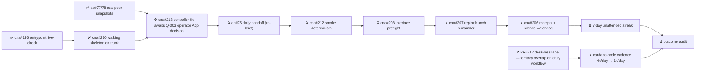

# M2 — Amaru tested routinely under fault injection

State — Updated: 2026-08-08
Legend: ✅ done · 🟡 active/next · ⏳ queued · ⛔ blocked · ❓ unknown

🟡 Next action (operator): Q-003 — dedicated least-privilege GitHub App on lambdasistemi/amaru-bootstrap; DAILY_AMARU_APP_ID + DAILY_AMARU_APP_PRIVATE_KEY into cna. Everything queued unblocks from it.

Notes: daily fires 08-06/07/08 red as DECLARED (controller defect + missing App identity); zero real Antithesis runs consumed; receipts correctly ABSENCE-RED. Machine-wide pause since 2026-08-08 20:55Z; chain parked; resume order A-003 → cna#213 → ab#75 → cadence ticket.
