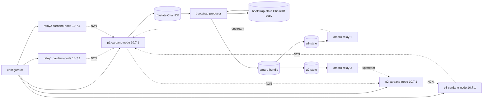

# Cardano Amaru

`cardano_amaru` is the first Antithesis testnet that starts relay-only
Amaru nodes from a bootstrap bundle produced inside the cluster.

The integration deliberately pins the node release. The
`amaru-bootstrap-producer` image used here emits an Amaru bootstrap
projection for cardano-node 10.7.1 ledger state, so every cardano-node
service in this testnet uses:

```text
ghcr.io/intersectmbo/cardano-node@sha256:3275d357053d21f3220f74b0854fd584e1fe322dfa1bbb78effd760c3191d14c
```

The digest is verified against the upstream
`ghcr.io/intersectmbo/cardano-node:10.7.1-amd64` tag. The compose file
uses the digest-only spelling because Antithesis image parameters accept
tag or digest references, but reject Docker's combined
`repo:tag@sha256:digest` form before any images are pulled.

The producer image is pinned to the `amaru-bootstrap` commit that passed
CI and published the runtime image:

```text
ghcr.io/lambdasistemi/amaru-bootstrap-producer:pr-32-ad64e76778b0408ec66f353c7e58c8a1e7d4045f
```

## Stake Roles

Amaru is relay-only in this testnet. It is not assigned stake, and it is
not given producer credentials.

The only stake-bearing block producers are:

- `p1`
- `p2`
- `p3`

The Amaru services receive no KES key, VRF key, cold key, operational
certificate, or stake-pool genesis assignment. They start with
`amaru run` and an upstream peer only.

## Perturbator Policy

The Amaru testnets keep the observability and assertion services
(`tracer`, `tracer-sidecar`, `log-tailer`, and `sidecar`) but remove the
transaction perturbator workload. There is no `tx-generator` service in
`cardano_amaru` or `cardano_amaru_epoch3600`; these profiles isolate the
cardano-node-to-Amaru bootstrap and relay-loading path.

## Fast Bootstrap Profile

The `cardano_amaru` testnet intentionally shortens the epoch/security
window:

```yaml
protocolConsts:
  k: 10
epochLength: 120
securityParam: 10
activeSlotsCoeff: 0.2
TestConwayHardForkAtEpoch: 0
```

The producer needs two complete Conway epochs behind the immutable tip.
With the production-like `86400` slot epoch this local proof would take
roughly 48 hours. In `cardano_amaru`, Conway starts at epoch 0 and the
producer can become ready around slot `240`, so local and CI runs can
wait for the real producer completion instead of only proving cluster
startup. The dense active slot coefficient makes enough blocks immutable
inside that short window; without it the immutable ChainDB tip can remain
at genesis even after the slot threshold has passed.

The `cardano_amaru_epoch3600` testnet keeps the same topology and
bootstrap path but uses 3600-slot epochs:

```yaml
protocolConsts:
  k: 10
epochLength: 3600
securityParam: 10
activeSlotsCoeff: 0.2
TestConwayHardForkAtEpoch: 0
```

It is meant for one-hour Antithesis campaigns, where simulated time can
cover enough chain time for two complete Conway epochs. It is not part of
the default wall-clock smoke matrix.

## Log Budget

Antithesis log ingestion is deliberately kept small. The Amaru relay
containers set `AMARU_LOG=warn`, `AMARU_TRACE=warn`, and
`AMARU_COLOR=never`, and their shell wrapper does not print polling
heartbeats while waiting for the bootstrap bundle. The bootstrap
producer wrapper also avoids retry heartbeats; retryable readiness misses
refresh the snapshot silently, with per-attempt logs retained under
`/srv/amaru/.logs` inside the bundle volume. The smoke test asserts
those environment settings before accepting the relay load proof.

## Topology



The Amaru relay nodes do not share writable stores. Each relay entrypoint
waits for the atomically committed bundle, copies it into a private state
volume, and then execs `amaru run`. They also do not peer with each
other: both are downstream consumers of cardano-node producers. That
avoids exercising Amaru's block-fetch responder path while this test is
only proving bootstrap loading.

## Bootstrap Contract

`bootstrap-producer` owns the snapshot-refresh loop. It mounts the live
`p1` ChainDB read-only at `/live`, copies it into the isolated
`bootstrap-state` volume at `/cardano/state`, and then runs the upstream
producer command against that copy:

```text
bootstrap-producer /cardano/state /cardano/config/configs /srv/amaru testnet_42
```

The producer verifies that the immutable tip in the copied ChainDB is
era-ready, emits three ledger snapshots for the target window, converts
them through Amaru, extracts headers and nonces, imports all data into
Amaru stores, and atomically commits:

```text
/srv/amaru/testnet_42/
|-- chain.testnet_42.db/
|-- ledger.testnet_42.db/
|-- snapshots/
|-- headers/
`-- nonces.json
```

Readiness and snapshot-race failures are retryable in this Antithesis
composition. If the producer returns exit `1` (`cluster-not-ready`), exit
`2` (`chain-not-era-ready`), exit `5` (`tool-error: emit`), or exit `7`
(`tool-error: extract`), the wrapper refreshes the snapshot and tries
again inside the same container. Each producer attempt uses a short
readiness deadline so the wrapper refreshes stale snapshots instead of
waiting twenty minutes on a copy that cannot mature. This matters under
fault injection: a single copied ChainDB can be too early forever, and
surfacing that as a container exit would make Antithesis report an
infrastructure failure instead of letting the cluster continue until a
mature snapshot exists. Configuration, conversion, nonce, import, and
output-write failures still exit non-zero because those are real
bootstrap defects.

The producer ChainDB mount is intentionally read-write:

```yaml
volumes:
  - p1-state:/live:ro
  - bootstrap-state:/cardano/state
```

This is not a live-node write contract. It is required because
cardano-node 10.7.1's consensus ImmutableDB validation path opens chunk
files through APIs that reject read-only filesystems. The live `p1`
ChainDB remains read-only to this service; only the isolated
`bootstrap-state` copy is opened by the producer.

## Local Verification

Validate the Compose model:

```bash
INTERNAL_NETWORK=false docker compose -f testnets/cardano_amaru/docker-compose.yaml config
```

Run the standard smoke test:

```bash
./scripts/smoke-test.sh cardano_amaru 600
```

That smoke test proves the cardano-node network and sidecar convergence
checks still work with the Amaru services present. Since the Amaru
profiles do not include `tx-generator`, the generic tx-generator smoke
gate is skipped. For `cardano_amaru`, the smoke then waits for
`bootstrap-producer` to exit `0`, checks that `amaru-relay-1` and
`amaru-relay-2` copied the bundle into private state volumes and stayed
running after `amaru run` opened those stores, and executes the same
`finally_amaru_started` proof that Antithesis discovers under the
existing `/opt/antithesis/test/v1/convergence/` template.

The long-epoch variant can be validated locally with a larger bootstrap
timeout, but it is primarily intended for Antithesis:

```bash
AMARU_BOOTSTRAP_SMOKE_TIMEOUT=9000 ./scripts/smoke-test.sh cardano_amaru_epoch3600 600
```

The same smoke command runs in both the PR image-publish workflow and
the manual smoke workflow, after the existing `cardano_node_master`
smoke.

For a bootstrap-specific cluster run, watch:

```bash
docker compose -f testnets/cardano_amaru/docker-compose.yaml logs -f bootstrap-producer
docker compose -f testnets/cardano_amaru/docker-compose.yaml ps bootstrap-producer amaru-relay-1 amaru-relay-2
```

The success evidence is:

- `bootstrap-producer` prints `wrote /srv/amaru/testnet_42` and exits
  `0`;
- `amaru-relay-1` and `amaru-relay-2` copy the bundle into private state
  volumes;
- `amaru-relay-1` and `amaru-relay-2` enter `amaru run` and remain
  running without a restart during the smoke gate;
- `parallel_driver_amaru_started.sh` emits `amaru_relays_started` when
  it samples both relay startup markers, and `finally_amaru_started.sh`
  fails the run if those markers are still missing at the final check.
  These Amaru proof commands are baked into the sidecar image under the
  existing `convergence` Test Composer template so the sidecar exposes
  one coherent template to Antithesis.
- the Amaru profiles give the sidecar convergence checks a larger
  post-fault recovery budget than the default profile (`30s` settle,
  `15` attempts, `3s` delay) because the one-hour Antithesis campaign
  can stop faults immediately after a transient producer-tip split.

## What This Does Not Prove

This stack does not retarget `amaru-bootstrap` to a newer node release.
Moving beyond cardano-node 10.7.1 requires a deliberate upstream
retarget, because ledger CBOR and ChainDB APIs drift laterally across
node releases.

The smoke proof runs on a deliberately short-epoch testnet. It proves the
producer and relay load path for the target node release, but it is not a
production-epoch-duration soak test and does not assign stake to Amaru.
