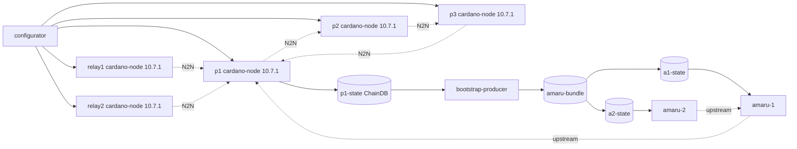

# Cardano Amaru

`cardano_amaru` is the first Antithesis testnet that starts Amaru from
a bootstrap bundle produced inside the cluster.

The integration deliberately pins the node release. The
`amaru-bootstrap-producer` image used here emits an Amaru bootstrap
projection for cardano-node 10.7.1 ledger state, so every cardano-node
service in this testnet uses:

```text
ghcr.io/intersectmbo/cardano-node:10.7.1-amd64@sha256:3275d357053d21f3220f74b0854fd584e1fe322dfa1bbb78effd760c3191d14c
```

The producer image is pinned to the `amaru-bootstrap` commit that passed
CI and published the runtime image:

```text
ghcr.io/lambdasistemi/amaru-bootstrap-producer:83e2f7af6b915e805f4c231f0d5bfe4ad5fa14d6
```

## Topology



The Amaru nodes do not share writable stores. Each Amaru entrypoint
waits for the atomically committed bundle, copies it into a private state
volume, and then execs `amaru run`.

## Bootstrap Contract

`bootstrap-producer` runs once:

```text
bootstrap-producer /cardano/state /cardano/config/configs /srv/amaru testnet_42
```

It waits for the producer node's immutable ChainDB to be era-ready, emits
three ledger snapshots for the target window, converts them through
Amaru, extracts headers and nonces, imports all data into Amaru stores,
and atomically commits:

```text
/srv/amaru/testnet_42/
|-- chain.testnet_42.db/
|-- ledger.testnet_42.db/
|-- snapshots/
|-- headers/
`-- nonces.json
```

The ChainDB mount is intentionally read-write:

```yaml
volumes:
  - p1-state:/cardano/state
```

This is not a write contract for the producer. It is required because
cardano-node 10.7.1's consensus ImmutableDB validation path opens chunk
files through APIs that reject read-only filesystems.

## Local Verification

Validate the Compose model:

```bash
INTERNAL_NETWORK=false docker compose -f testnets/cardano_amaru/docker-compose.yaml config
```

Run the standard smoke test:

```bash
./scripts/smoke-test.sh cardano_amaru 600
```

That smoke test proves the cardano-node network, sidecar, and
tx-generator still work with the Amaru services present. A fresh local
testnet usually does not make the bootstrap producer finish within the
smoke-test window because the producer waits until two complete Conway
epochs are behind the immutable tip.

The same smoke command runs in both the PR image-publish workflow and
the manual smoke workflow, after the existing `cardano_node_master`
smoke.

For a bootstrap-specific cluster run, watch:

```bash
docker compose -f testnets/cardano_amaru/docker-compose.yaml logs -f bootstrap-producer
docker compose -f testnets/cardano_amaru/docker-compose.yaml ps bootstrap-producer amaru-1 amaru-2
```

The success evidence is:

- `bootstrap-producer` prints `wrote /srv/amaru/testnet_42` and exits
  `0`;
- `amaru-1` and `amaru-2` copy the bundle into private state volumes;
- `amaru-1` and `amaru-2` enter `amaru run`.

## What This Does Not Prove

This stack does not retarget `amaru-bootstrap` to a newer node release.
Moving beyond cardano-node 10.7.1 requires a deliberate upstream
retarget, because ledger CBOR and ChainDB APIs drift laterally across
node releases.

The standard local smoke test also does not prove that the bootstrap
bundle contains transaction-heavy history. It proves the node network and
drivers still operate while the Amaru bootstrap wiring is present. The
bootstrap producer itself consumes the immutable ChainDB window available
when its era-readiness predicate finally passes.
