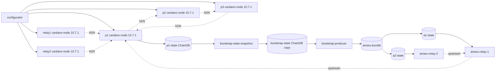

# Cardano Amaru

`cardano_amaru` is the first Antithesis testnet that starts relay-only
Amaru nodes from a bootstrap bundle produced inside the cluster.

The integration deliberately pins the node release. The
`amaru-bootstrap-producer` image used here emits an Amaru bootstrap
projection for cardano-node 10.7.1 ledger state, so every cardano-node
service in this testnet uses:

```text
ghcr.io/intersectmbo/cardano-node@sha256:3275d357053d21f3220f74b0854fd584e1fe322dfa1bbb78effd760c3191d14c
```

The digest is verified against the upstream
`ghcr.io/intersectmbo/cardano-node:10.7.1-amd64` tag. The compose file
uses the digest-only spelling because Antithesis image parameters accept
tag or digest references, but reject Docker's combined
`repo:tag@sha256:digest` form before any images are pulled.

The producer image is pinned to the `amaru-bootstrap` commit that passed
CI and published the runtime image:

```text
ghcr.io/lambdasistemi/amaru-bootstrap-producer:d81dd7d31e1c23b3223d3c4155294b82dc56ea0e
```

The tx-generator image is also pinned deliberately:

```text
ghcr.io/cardano-foundation/cardano-node-antithesis/tx-generator:6808a14
```

That image rebuilds the daemon against
`lambdasistemi/cardano-node-clients@898a2c470ced6a82fa5a32b18cbaf195e1cce927`,
the merge commit for
`https://github.com/lambdasistemi/cardano-node-clients/pull/105`. The
pin matters for Antithesis because the daemon now supervises its N2C
connection and turns GHC's `BlockedIndefinitelyOnSTM` detection on
in-flight LSQ/LTxS calls into the typed `ConnectionLost` path. Composer
requests then get a retryable control response instead of a daemon exit.
The composer records transient control-socket gaps as reachable telemetry
rather than as a failing SDK assertion, because the command can be
scheduled before the daemon is ready or while the upstream relay is being
faulted.

## Stake Roles

Amaru is relay-only in this testnet. It is not assigned stake, and it is
not given producer credentials.

The only stake-bearing block producers are:

- `p1`
- `p2`
- `p3`

The Amaru services receive no KES key, VRF key, cold key, operational
certificate, or stake-pool genesis assignment. They start with
`amaru run` and an upstream peer only.

## Fast Bootstrap Profile

This testnet intentionally shortens the epoch/security window:

```yaml
protocolConsts:
  k: 10
epochLength: 120
securityParam: 10
activeSlotsCoeff: 0.2
TestConwayHardForkAtEpoch: 0
```

The producer needs two complete Conway epochs behind the immutable tip.
With the production-like `86400` slot epoch this local proof would take
roughly 48 hours. In `cardano_amaru`, Conway starts at epoch 0 and the
producer can become ready around slot `240`, so local and CI runs can
wait for the real producer completion instead of only proving cluster
startup. The dense active slot coefficient makes enough blocks immutable
inside that short window; without it the immutable ChainDB tip can remain
at genesis even after the slot threshold has passed.

## Log Budget

Antithesis log ingestion is deliberately kept small. The Amaru relay
containers set `AMARU_LOG=warn`, `AMARU_TRACE=warn`, and
`AMARU_COLOR=never`, and their shell wrapper does not print polling
heartbeats while waiting for the bootstrap bundle. The smoke test asserts
those environment settings before accepting the relay load proof.

## Topology



The Amaru relay nodes do not share writable stores. Each relay entrypoint
waits for the atomically committed bundle, copies it into a private state
volume, and then execs `amaru run`.

## Bootstrap Contract

`bootstrap-state-snapshot` runs first. It polls `p1` through the local
node socket until the chain reaches slot `360`, copies the mature ChainDB
into the isolated `bootstrap-state` volume, and exits `0`.

`bootstrap-producer` runs once:

```text
bootstrap-producer /cardano/state /cardano/config/configs /srv/amaru testnet_42
```

It opens the copied ChainDB, verifies that the immutable tip is era-ready,
emits three ledger snapshots for the target window, converts them through
Amaru, extracts headers and nonces, imports all data into Amaru stores,
and atomically commits:

```text
/srv/amaru/testnet_42/
|-- chain.testnet_42.db/
|-- ledger.testnet_42.db/
|-- snapshots/
|-- headers/
`-- nonces.json
```

The producer ChainDB mount is intentionally read-write:

```yaml
volumes:
  - bootstrap-state:/cardano/state
```

This is not a live-node write contract. It is required because
cardano-node 10.7.1's consensus ImmutableDB validation path opens chunk
files through APIs that reject read-only filesystems. The live `p1`
ChainDB is mounted read-only by the snapshot service only, and the
producer never opens it directly.

## Local Verification

Validate the Compose model:

```bash
INTERNAL_NETWORK=false docker compose -f testnets/cardano_amaru/docker-compose.yaml config
```

Run the standard smoke test:

```bash
./scripts/smoke-test.sh cardano_amaru 600
```

That smoke test proves the cardano-node network, sidecar, and
tx-generator still work with the Amaru services present. For
`cardano_amaru`, it additionally waits for `bootstrap-producer` to exit
`0`, then checks that `amaru-relay-1` and `amaru-relay-2` copied the
bundle into private state volumes and stayed running after `amaru run`
opened those stores.

The same smoke command runs in both the PR image-publish workflow and
the manual smoke workflow, after the existing `cardano_node_master`
smoke.

For a bootstrap-specific cluster run, watch:

```bash
docker compose -f testnets/cardano_amaru/docker-compose.yaml logs -f bootstrap-producer
docker compose -f testnets/cardano_amaru/docker-compose.yaml ps bootstrap-state-snapshot bootstrap-producer amaru-relay-1 amaru-relay-2
```

The success evidence is:

- `bootstrap-state-snapshot` prints `copied p1 ChainDB at slot ...` and
  exits `0`;
- `bootstrap-producer` prints `wrote /srv/amaru/testnet_42` and exits
  `0`;
- `amaru-relay-1` and `amaru-relay-2` copy the bundle into private state
  volumes;
- `amaru-relay-1` and `amaru-relay-2` enter `amaru run` and remain
  running without a restart during the smoke gate.

## What This Does Not Prove

This stack does not retarget `amaru-bootstrap` to a newer node release.
Moving beyond cardano-node 10.7.1 requires a deliberate upstream
retarget, because ledger CBOR and ChainDB APIs drift laterally across
node releases.

The smoke proof runs on a deliberately short-epoch testnet. It proves the
producer and relay load path for the target node release, but it is not a
production-epoch-duration soak test and does not assign stake to Amaru.
